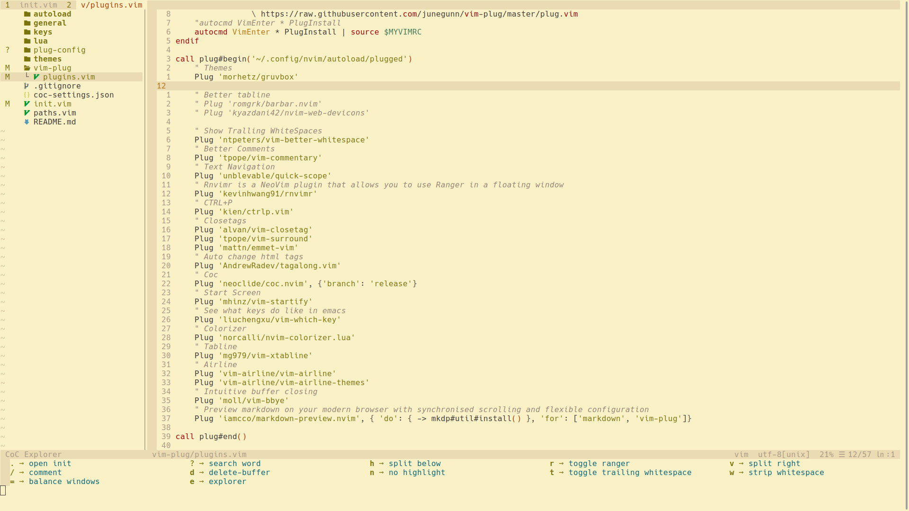

# ✨ Nvim Configurations ✨

* [Clone Repo](#clone-repo)
* [Installation](#installation)
* [Conclusion](#conclusion)

## Preview

## Clone repo

    git clone git@github.com:anton-dovnar/nvim.git ~/.config/

## Installation

* Install [Neovim](https://neovim.io/)
* Nodejs [nodesource/distributions](https://github.com/nodesource/distributions#table-of-contents)
* Set default terminal font (for icons) [NerdFont](https://www.nerdfonts.com/font-downloads)
* Install ranger with dependencies [Rnvimr](https://github.com/kevinhwang91/rnvimr#dependence)
* Configure python paths in next files (paths.vim, coc-settings.json)

## Conclusion

✅ Check nevoim health with next command:

    :checkhealth
